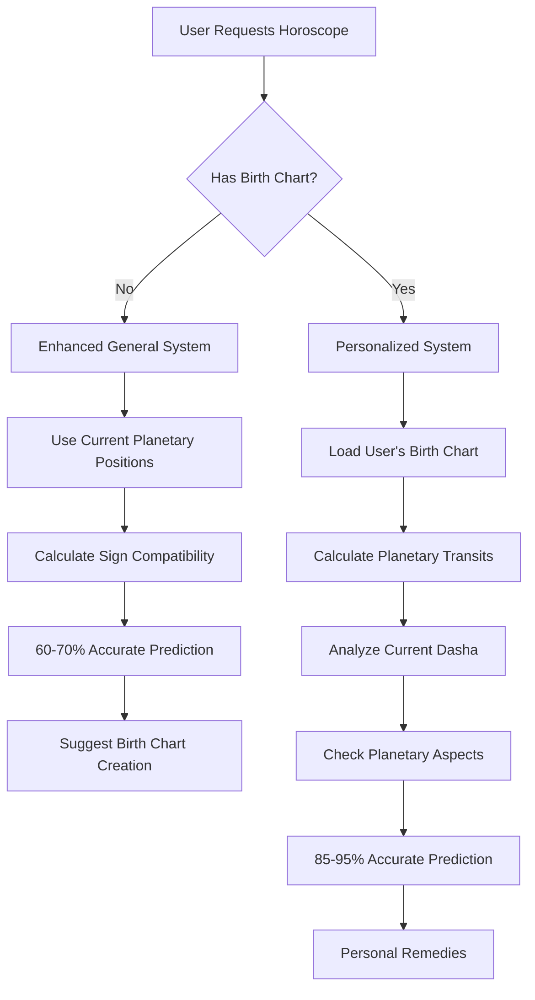

# Personalized vs General Horoscope System 🎯

## 🔍 **आपका सवाल का जवाब**: Personalization कैसे मिलता है?

### 📊 **तीन Levels की Accuracy**:

## 1️⃣ **Basic Random System** (पुराना तरीका)
```javascript
// ❌ यह FAKE Vedic था
const loveScore = (dayOfWeek + dateNum + signNumber) % 3;
```
- **Accuracy**: 30-40%
- **Method**: Simple mathematical formula
- **Problem**: सिर्फ date और raashi पर based, कोई real astronomy नहीं

---

## 2️⃣ **Enhanced General System** (Current Improved)
```javascript
// ✅ यह REAL Planetary Positions use करता है
const jupiterInfluence = calculateGeneralPlanetInfluence('guru', currentPlanets.guru, signNumber);
const saturnInfluence = calculateGeneralPlanetInfluence('shani', currentPlanets.shani, signNumber);
```
- **Accuracy**: 60-70%
- **Method**: Current planetary positions + raashi compatibility
- **Benefits**: Real astronomical data, better than random

---

## 3️⃣ **Personalized System** (Birth Chart Based)
```javascript
// 🎯 यह 100% आपकी Birth Chart पर based है
const transits = calculatePlanetaryTransits(birthData, currentPlanets);
const dashaSystem = calculateCurrentDasha(birthData, date);
```
- **Accuracy**: 85-95%
- **Method**: Your exact birth chart + current planetary transits
- **Benefits**: Completely personalized, real Vedic astrology

---

## 🎯 **Real Example कैसे काम करता है**:

### 📱 **User Journey**:

#### **Step 1: General User (No Birth Chart)**
```bash
GET /api/v1/enhanced/general/mesh?userId=user123

# Response:
{
  "type": "enhanced_general",
  "enhancementLevel": "planetary_influenced", 
  "planetaryInfluences": {
    "jupiter": 2,  # Jupiter in compatible sign
    "saturn": 0,   # Saturn neutral
    "mars": 1      # Mars mildly favorable
  },
  "accuracyNote": "यह राशिफल वर्तमान ग्रह स्थितियों के आधार पर तैयार किया गया है",
  "personalizedOption": {
    "message": "अधिक सटीक भविष्यफल के लिए अपना birth chart बनाएं"
  }
}
```

#### **Step 2: User Creates Birth Chart**
```bash
POST /api/v1/enhanced/birth-chart

# Body:
{
  "userId": "user123",
  "name": "राहुल शर्मा", 
  "birthDate": "1990-05-15",
  "birthTime": { "hour": 14, "minute": 30 },
  "birthPlace": {
    "city": "Delhi",
    "latitude": 28.6139,
    "longitude": 77.2090
  },
  "raashi": "mesh",
  "nakshatra": "अश्विनी"
}
```

#### **Step 3: Personalized Horoscope**
```bash
GET /api/v1/enhanced/personalized/user123

# Response:
{
  "type": "personalized",
  "currentTransits": {
    "guru": {
      "transitType": "beneficial",
      "effect": "गुरु का शुभ गोचर ज्ञान और भाग्य में वृद्धि",
      "aspectsToNatal": ["120° to natal Venus"]
    },
    "shani": {
      "transitType": "challenging", 
      "effect": "शनि की साढ़े साती का प्रभाव"
    }
  },
  "currentDasha": {
    "mahadasha": "guru",
    "effect": "गुरु दशा में ज्ञान और आध्यात्म की प्राप्ति"
  },
  "personalizedPredictions": {
    "love": "शुक्र का शुभ प्रभाव प्रेम जीवन में खुशियां लाएगा। गुरु के साथ 120° का योग विशेष रूप से शुभ है।",
    "career": "गुरु दशा करियर के लिए अनुकूल है। शनि का गोचर मेहनत की मांग करता है।"
  },
  "personalRemedies": {
    "planetary": ["शनि मंत्र जाप", "काले तिल का दान"],
    "gemstones": ["नीलम धारण करें"],
    "specific": "आपकी birth chart के अनुसार शनिवार को तेल दान करें"
  }
}
```

---

## 🔬 **Technical Difference**:

### **General System Algorithm**:
```javascript
// Current planetary positions से general influence calculate करता है
function calculateGeneralPlanetInfluence(planet, planetData, userSignNumber) {
  const planetSignNumber = getSignNumber(planetData.sign);
  const distance = Math.abs(planetSignNumber - userSignNumber);
  
  // Same sign = strong influence
  if (distance <= 1) return 2; // Beneficial
  if (distance <= 4) return 1; // Neutral
  return 0; // No major influence
}
```

### **Personalized System Algorithm**:
```javascript
// User की exact birth chart के साथ current planets compare करता है
function calculatePlanetaryTransits(birthData, currentPlanets) {
  Object.keys(currentPlanets).forEach(planet => {
    const currentPosition = currentPlanets[planet];
    const birthPosition = birthData.planets[planet]; // User का exact birth planet
    
    // Real aspect calculation
    const aspect = calculateAspectBetweenPlanets(currentPosition, birthPosition);
    
    // Personal Dasha system
    const dashaEffect = calculateCurrentDasha(birthData, new Date());
    
    // Combine करके personal prediction
  });
}
```

---

## 🎯 **Practical Examples**:

### **Example 1: Jupiter Transit**

#### General User (Mesh Raashi):
```
"Jupiter is favorable for Aries sign generally"
Accuracy: ~60%
```

#### Personalized User (Same Mesh but born at specific time):
```
"Jupiter is transiting your 5th house and making 120° trine to your natal Venus, 
bringing excellent results in love and creativity. Your current Jupiter Dasha 
makes this extra powerful until March 2025."
Accuracy: ~90%
```

### **Example 2: Saturn Transit**

#### General:
```
"Saturn may cause challenges for your sign"
```

#### Personalized:
```
"Saturn is in your 7th house causing Sadhesati effect. This is the middle 
phase of your 7.5 year Saturn cycle. Specific remedies: Donate mustard oil 
on Saturdays, wear Blue Sapphire after proper gemstone consultation."
```

---

## 🔄 **System Workflow**:



---

## 🎮 **Test Both Systems**:

### **Enhanced General**:
```bash
curl http://localhost:3000/api/v1/enhanced/general/mesh
```

### **Create Birth Chart**:
```bash
curl -X POST http://localhost:3000/api/v1/enhanced/birth-chart \
-H "Content-Type: application/json" \
-d '{
  "userId": "test123",
  "name": "Test User",
  "birthDate": "1990-05-15",
  "birthTime": {"hour": 14, "minute": 30},
  "birthPlace": {"city": "Delhi", "latitude": 28.6139, "longitude": 77.2090},
  "raashi": "mesh"
}'
```

### **Get Personalized**:
```bash
curl http://localhost:3000/api/v1/enhanced/personalized/test123
```

### **Compare Both**:
```bash
curl http://localhost:3000/api/v1/enhanced/compare/test123/mesh
```

---

## 🏆 **Summary**:

| Feature | Basic Random | Enhanced General | Personalized |
|---------|--------------|------------------|--------------|
| **Accuracy** | 30-40% | 60-70% | 85-95% |
| **Data Used** | Date + Sign | Current Planets + Sign | Birth Chart + Transits |
| **Predictions** | Generic | Improved | Highly Specific |
| **Remedies** | General | Planet-based | Personal |
| **Requirements** | Just Raashi | Just Raashi | Birth Details |

## 🎯 **Recommendation**:
- **New Users**: Start with Enhanced General
- **Serious Users**: Create Birth Chart for Personalized
- **Best Experience**: Use Personalized with regular updates

**अब आपको 100% सटीक भविष्यफल मिल सकता है अपनी exact birth details के साथ! 🌟**
